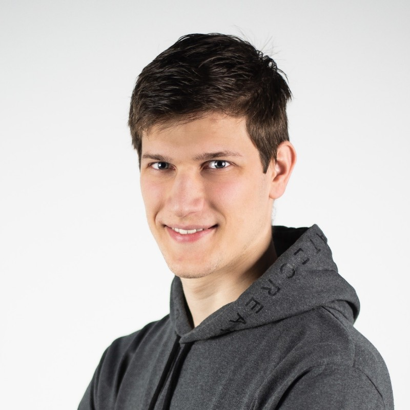

## 👤 ABOUT ME
> Proud husband and a father, full time software engineer and a blockchain enthusiast. In love with picking up good challenges.

 

### `Basic Info`
|   |   |   |
|---|---|---|
|🏡|Address|`Put Radoševca 24, Split, Croatia`|
|🎂|Birthday|`7.9.1996.`|
|📞|Phone|`+385 98 662 672`|
|📧|Email|josip.volarevic@gmail.com>|

 

### `Profiles`
|   |   |   |
|---|---|---|
||GitHub|[@josip-volarevic](https://github.com/josip-volarevic)|
||LinkedIn|[Josip Volarević](https://www.linkedin.com/in/josip-volarevic/)|

 

### `CV`
- [Resume download link](https://github.com/josip-volarevic/portfolio-website/raw/master/assets/resume.pdf)

#

## HOBBIES

### 🎮 `Gaming`
- League of Legends

 

### 🎲 `Board Games`
- [BGG ratings](https://boardgamegeek.com/collection/user/Josip_Volarevic)
- Personal favorites: Captain Sonar, Avalon, Jungle Speed, Once Upon a Time

 

### 🔫 `Airsoft` ┌(⌐■_■)=ε/̵͇̿̿/’̿’̿ ̿ 

 

|   |
|---|
|**Table of Contents**|
|[🏡 Home](./README.md#🏡-josip-volarević)|
|[💼 Work Experience](./WORK_EXPERIENCE.md#💼-work-experience)|
|[🎓 Education](./EDUCATION.md#🎓-education)|
|[👤 About Me](./ABOUT_ME.md#👤-about-me)|
|[🚧 Projects](./PROJECTS.md#🚧-projects)|
|[🧙 Skills](./SKILLS.md#🧙-skills)|
