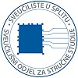

## 💼 WORK EXPERIENCE

|   |   |
|---|---|
||SOFTWARE ENGINEER ↠ Longwood Labs <small>Jan 2022 - Sep 2022 · 9 mos</small>|
||- Developed a gamified staking solution for "The Remnants" NFT collection on Solana blockchain - Worked on blazing edge technologies in a fast-paced (startup) environment `React.js · TypeScript · NestJS · NFTs · Metaplex.js · web3.js · ReactQuery · MaterialUI · GCP · PostgreSQL`|

|   |   |
|---|---|
||SOFTWARE ENGINEER ↠ Maestral Solutions <small>Nov 2021 - Feb 2022 · 4 mos</small>|
||- Worked solely on delivering a new feature for an Enterprise level client `React.js · TypeScript · SASS · Figma`|

|   |   |
|---|---|
||SOFTWARE ENGINEER ↠ Pseudocode <small>Jun 2020 - Nov 2021 · 1 yr 6 mos</small>|
||- Worked in teams to build high standard applications from ground up - Communicated with clients to make the best out of Trello tickets - Participated in daily standups and bi-weekly demos to clients (advanced English) - "Owned" specific features `React.js · TypeScript · Next.js · NestJS · Amazon S3 · MaterialUI · Figma · SASS · PostgreSQL`|

|   |   |
|---|---|
||FRONTEND DEVELOPER ↠ KupiGume.hr <small>Feb 2020 - May 2020 · 4 mos</small>|
||- Maintained kupigume.hr website and added new features - Developed React applications for internal company use `React.js · TypeScript · Node.js · SASS`|

|   |   |
|---|---|
||SOFTWARE DEVELOPER (internship) ↠ Netmedia Sistemi <small>Oct 2019 - Nov 2019 · 2 mos</small>|
||- Maintained existing web shop applications - Created a nopCommerce plugin for ApplicationInsights integration `C# · nopCommerce`|

|   |   |
|---|---|
||SOFTWARE DEVELOPER (internship) ↠ Filip Informatika <small>Feb 2019 - Apr 2019 · 3 mos</small>|
||- Created and maintained web shops `C# · nopCommerce · WordPress`|

|   |   |
|---|---|
||IT ASSISTANT ↠ Luxury Croatia <small>Nov 2018 - Feb 2019 · 4 mos</small>|
||- Developed WordPress websites and maintained existing ones - Automated ~50% of repetitive web tasks `WordPress`|

|   |   |
|---|---|
||DEMONSTRATOR ↠ University Department of Professional Studies <small>Oct 2018 - Feb 2019 · 5 mos</small>|
||- Mentored freshmen on laboratory exercises `Python · JavaScript`|

 

|   |
|---|
|**Table of Contents**|
|[🏡 Home](./README.md#🏡-josip-volarević)|
|[💼 Work Experience](./WORK_EXPERIENCE.md#💼-work-experience)|
|[🎓 Education](./EDUCATION.md#🎓-education)|
|[👤 About Me](./ABOUT_ME.md#👤-about-me)|
|[🚧 Projects](./PROJECTS.md#🚧-projects)|
|[🧙 Skills](./SKILLS.md#🧙-skills)|
